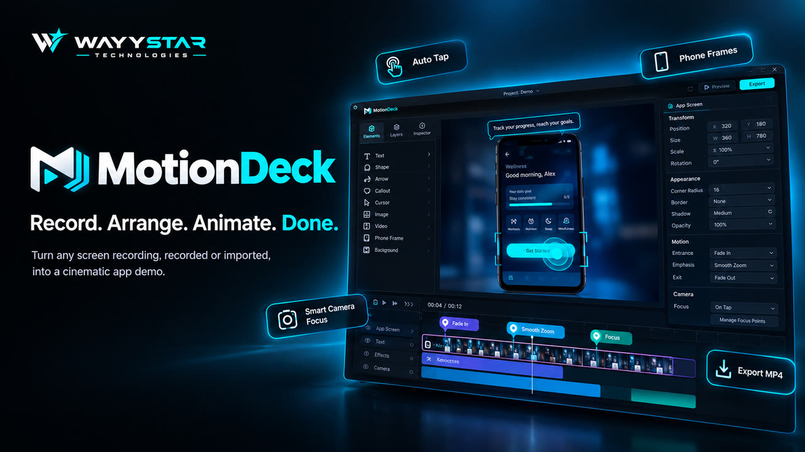

# MotionDeck

**Record. Arrange. Animate. Done.**

MotionDeck is a beginner-friendly desktop motion-design tool that turns any screen recording, recorded or imported, into a cinematic app demo video. Add Auto Tap markers, phone frames, smart camera focus, and motion presets (fade, smooth zoom, focus) on a simple timeline, then export an MP4. No keyframe editor to learn.

Free and open source (MIT). Runs as a Windows desktop app (Tauri) and in Chromium browsers. Recordings and projects stay on your machine.

[Product page](https://wayystartechnologies.online/work/motiondeck) · Built by [WAYYSTAR Technologies](https://wayystartechnologies.online)



## What it does

- Record a screen, window, or region, or import a video you already have.
- Treat recorded and imported footage as the same kind of clip: move, crop, trim, animate, frame, and export it.
- Crop an Android emulator recording down to the app screen and nest it in a phone frame.
- Add entrance, emphasis, and camera motion without a keyframe timeline.
- Preview and export through the same canvas compositor (MP4, WebM, or GIF).

## Core workflow

1. Create a project (or open the sample).
2. Record inside MotionDeck, or import an MP4, MOV, or WebM.
3. Select the clip. Drag, resize, crop, or press **A** to animate.
4. Optional: **Crop App Screen**, add a phone frame, focus, text, and tap markers.
5. Preview on the timeline, then export.

## Supported platforms

| Environment | Status |
| --- | --- |
| Windows 10/11 desktop (Tauri) | Primary target. Native cursor capture and system FFmpeg detection are implemented here. |
| Browser (Chromium) | Editing, import, preview, and WebCodecs export. Screen capture uses the browser picker. Global cursor sampling is not available. |
| macOS / Linux | The Tauri project can be built there, but this release pass was not verified on those systems. |

Unusual containers (MKV, AVI, and similar) are converted in the app with ffmpeg.wasm, or with system FFmpeg when MotionDeck Desktop finds it. If conversion fails, export the file as MP4 (H.264 + AAC) from your capture tool.

## Install and run

Requirements:

- Node.js 20 or newer
- For the desktop shell: [Rust](https://rustup.rs/) and a C++ build toolchain (on Windows, Visual Studio Build Tools with the Desktop development with C++ workload)
- Optional: FFmpeg on `PATH` for faster system-side conversion of unusual imports. Exports themselves use WebCodecs and do not require FFmpeg.

```bash
npm install
npm run dev
```

Open [http://localhost:1420](http://localhost:1420).

Desktop shell:

```bash
npm run desktop
```

Production frontend bundle (no dev server):

```bash
npm run build
npm run preview
```

Desktop installer / release binary:

```bash
npm run desktop:build
```

## Scripts

| Command | What it does |
| --- | --- |
| `npm run dev` | Vite dev server on port 1420 |
| `npm run build` | Typecheck and production frontend bundle |
| `npm run preview` | Serve the production bundle |
| `npm run typecheck` | TypeScript project references |
| `npm run test` | Vitest unit tests |
| `npm run lint` | ESLint |
| `npm run desktop` | Tauri development shell |
| `npm run desktop:build` | Tauri production build |
| `npm run validate:android-export` | Headless Android app-screen export check (needs Chrome or Edge, and the dev server or Vite) |

## Export

Exports are rendered in-process from the same scene graph as the editor preview.

- **MP4** needs WebCodecs H.264 (`VideoEncoder`). Chromium and the desktop WebView provide this. If it is missing, use WebM or GIF.
- **WebM** and **GIF** are fallbacks.
- Audio is mixed from the clip when the file decodes. If mixdown fails, the video still exports and the app warns that audio was dropped.

## Known limitations

- Imported files do not contain MotionDeck’s cursor stream. Use **Detect Taps** (then review the guesses), **Mark path**, or **Add Interaction**. Detection looks for local frame changes; it is not an OS cursor log.
- App-screen tracking follows a template match. Low-confidence results should be corrected by hand. The crop is non-destructive.
- In-app conversion is capped around 180 MB. Larger exotic files need system FFmpeg or a pre-converted MP4.
- The desktop WebView’s content security policy is not locked down, so ffmpeg.wasm can load its core. Do not load untrusted remote pages in this window.

## Architecture

See [docs/ARCHITECTURE.md](docs/ARCHITECTURE.md).

Short version: one `VideoLayer` model, one compositor (`renderScene`) for preview and export, Zustand + Immer for the document, and OPFS (with an in-memory fallback) for media bytes.

## Contributing

See [CONTRIBUTING.md](CONTRIBUTING.md). Security reports: [SECURITY.md](SECURITY.md).

## Credits

MotionDeck is a [WAYYSTAR Technologies](https://wayystartechnologies.online) project. Learn more on the [MotionDeck product page](https://wayystartechnologies.online/work/motiondeck).

## License

[MIT](LICENSE). Copyright 2026 WAYYSTAR Technologies.
